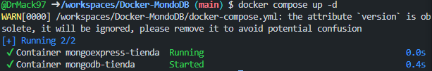
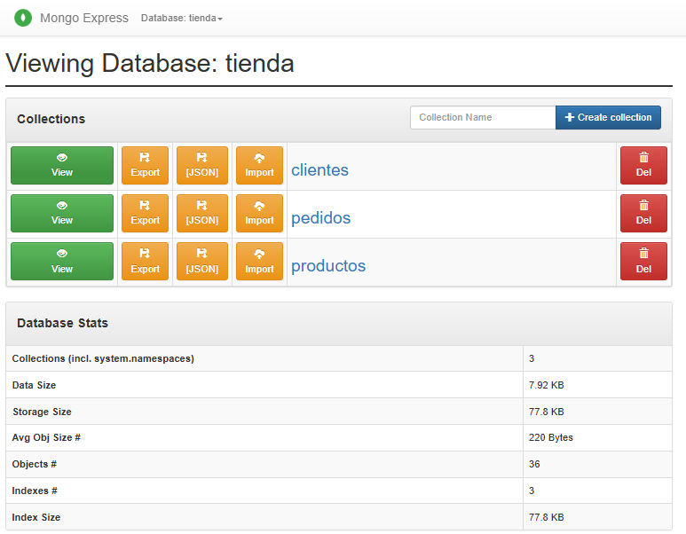
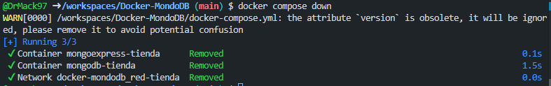
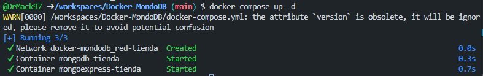
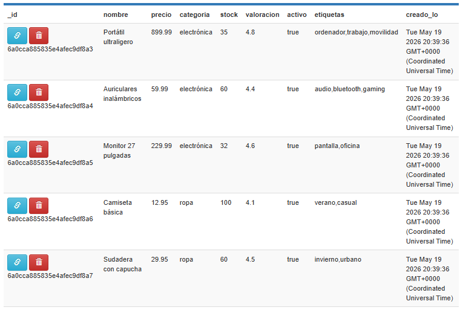

## Bloque 1 

# Preguntes teòriques

## 1) Quina és la diferència entre `docker run` i `docker compose up`?

### `docker run`
Crea y ejecuta un único contenedor a partir de una imagen, indicando la configuración desde la línea de comandos.

### `docker compose up`
Lee un archivo `docker-compose.yml` para crear, conectar y arrancar uno o varios contenedores que forman parte de una misma aplicación.

### Ámbito de uso

- Usa `docker run` cuando quieras probar una imagen rápidamente, ejecutar un contenedor puntual o lanzar un servicio independiente.

- Usa `docker compose up` cuando tu proyecto tenga varios servicios relacionados, por ejemplo una aplicación web y una base de datos.

## 2) Per a què serveix la instrucció `depends_on`? Garanteix que el servei dependent estigui completament operatiu?

### `depends_on`
Sirve para indicar el orden de arranque entre servicios. Por ejemplo, puedes hacer que MongoDB se inicie antes que otro contenedor que lo necesita.

### ¿Garantiza que esté operativo?
No. `depends_on` solo asegura que el contenedor se inicie antes que otro, pero no verifica que el servicio interno esté completamente listo para aceptar conexiones.

## 3) Explica cuál es la diferencia entre una red bridge por defecto y una red personalizada con nombre en Docker Compose

### Red bridge por defecto
- Docker asigna una red básica automáticamente.
- La comunicación entre contenedores puede ser más limitada en cuanto a resolución por nombre si no se define una red propia.
- Tiene menos control sobre configuración y aislamiento.

### Red personalizada
- Se define explícitamente en `docker-compose.yml`.
- Los contenedores pueden comunicarse usando el nombre del servicio.
- Ofrece más control, mejor organización y mayor aislamiento.

### Conclusión
En Docker Compose, una red personalizada suele ser la opción más recomendable porque facilita la comunicación entre servicios y mejora la estructura del entorno.

# BLOQUE 2

# Pantallazos:

1. Engega l'entorn: docker compose up -d

2. Accedeix a Mongo Express (http://localhost:8081) i verifica que existeix la BD botiga

3. Atura i elimina els contenidors: docker compose down

4. Torna a engegar: docker compose up -d

5. Verifica que les dades encara existeixen

# Preguntes teòriques

1. Què passaria si no definíssim cap volum al docker-compose.yml? Fes la prova i
documenta el resultat.

Si no defines ningún volumen en docker-compose.yml, los datos se guardan dentro del contenedor y se pierden al eliminarlo o recrearlo. 

En la práctica, eso significa que tras docker compose down y volver a levantar el entorno, la base de datos tienda volvería vacía o con los datos iniciales del script, según cómo arranques el contenedor. 

Docker explica que los bind mounts y named volumes son precisamente los mecanismos para persistir datos fuera del ciclo de vida del contenedor.

2. Explica la diferència entre un volum named (amb nom) i un bind mount (ruta del host). Quan convé usar cada un?

Un named volume lo gestiona Docker y no depende de una ruta concreta del host, así que es más portable y limpio para datos persistentes como bases de datos. 

Un bind mount enlaza una carpeta real del host con el contenedor, lo que es más cómodo en desarrollo porque ves y editas los archivos directamente desde tu máquina. 

Para una base de datos suele convenir named volume por robustez y portabilidad; para código o configuración editable, conviene bind mount.

3. Explica la diferència entre l’estratègia embedding i l’estratègia referència amb exemples.
Cal que els exemples siguin diferents dels que s’exposen en aquest document.

# EMBEDDING (Documentos Anidados)

Técnicamente, significa meter un documento de datos dentro de otro en un solo archivo JSON, utilizando objetos o listas (arrays). Los datos viven juntos en el mismo espacio de memoria.

frese:
"Embedding es guardar los datos relacionados juntos en el mismo documento para poder leerlos todos de golpe con una velocidad brutal."

# REFERENCIA (Normalización o Enlaces)

Técnicamente, significa separar los datos en colecciones distintas y unirlos mediante un identificador único (como un _id o un email) que apunta de un documento a otro. Es el equivalente a las Claves Foráneas (Foreign Keys) del mundo SQL.

frase:
"Referencia es separar los datos en colecciones diferentes conectadas por un ID, evitando que la información se duplique y facilitando que se actualice en un solo lugar"

4. Explica quina estratègia o estratègies has fet servir en la col·lecció comandes i per quin
motiu.

# pedidos referencia - embedding 

En este modelo de negocio, la colección pedidos actúa como el puente de unión entre clientes y productos.

Técnicamente, no existe ninguna relación directa ni campos compartidos entre un cliente y un producto por sí solos: un producto no sabe qué clientes lo han comprado, y un cliente no tiene una lista de productos en su perfil. Esa conexión solo "nace" cuando se genera una transacción (un pedido).

# Bloque 3 

para ejecutar CRUD.js:

docker compose down
docker compose up -d

docker cp ./queries/CRUD.js mongodb-tienda:/tmp/CRUD.js

docker exec -it mongodb-tienda mongosh -u david -p david97 --authenticationDatabase admin --eval 'load("/tmp/CRUD.js")'

# eliminar todos los volumenes no usados 

docker volume prune -f 

(que es un volumen? )

# preguntas teoricas bloque 3

1. Tal com has creat la col·lecció de productes, el seu nom és únic? Justifica la resposta.

No. En MongoDB, los nombres de colección solo deben ser únicos dentro de la misma base de datos. Puedes tener productos en tienda y también productos en ventas sin problema.

2. Què significa el terme “projectar” en les consultes? Explica-ho amb un exemple diferent del
d’aquest enunciat.

Seleccionar solo los campos que quieres ver, ocultando el resto. 

// Mostrar solo nombre y email de clientes (ocultar _id, teléfono, dirección)

3. Llista totes les funcions i operadors que hagis utilitzat en les consultes, explica el seu
significat i descriu un exemple d’ús diferent dels exemples d’aquest enunciat.

insertOne() / Inserta 1 documento

insertMany() / Inserta varios documentos

find() / Busca documentos

findOne() / Busca 1 documento

$lt / Menor que

$gt / Mayor que

$gte / Mayor o igual que

updateOne() / Actualiza 1 documento

updateMany() / Actualiza varios

$set / Establece valor de un campo

$inc / Incrementa valor numérico

$push / Añade elemento a array

deleteOne() / Elimina 1 documento

deleteMany() / Elimina varios

Proyección / Campos a mostrar/ocultar

db.productos.find(
  { precio: { $lt: 50 } },  // ← Filtro (1er argumento)
  { nombre: 1, precio: 1, _id: 0 }  // ← Proyección (2do argumento)
)

# bloque 4 advanced.js 

# ante algun cambio en crud:
docker cp ./queries/CRUD.js mongodb-tienda:/tmp/CRUD.js

# ante algun cambio en advanced.js
docker cp ./queries/advanced.js mongodb-tienda:/tmp/advanced.js

# 1. Asegurar contenedores
docker-compose up -d

# Ejecutar CRUD

docker exec -it mongodb-tienda mongosh -u david -p david97 --authenticationDatabase admin --eval 'load("/tmp/CRUD.js")'

1. Quan pot ser perjudicial tenir massa índexs en una col·lecció? Explica el compromís
(trade-off) entre lectura i escriptura.

Tener demasiados índices es perjudicial cuando predominan las operaciones de escritura (INSERT, UPDATE, DELETE), porque cada modificación en la colección obliga a actualizar todos los índices, ralentizando significativamente el rendimiento. Además, consumen más RAM, espacio en disco y aumentan el tiempo de los backups. Existe un trade-off entre lectura y escritura: los índices aceleran las consultas (reads) pero frenan las modificaciones (writes). Por eso, lo recomendable es crear solo los índices necesarios para las consultas más frecuentes, generalmente entre 3 y 5 por colección.

2. Llista totes les funcions i operadors que hagis utilitzat en les consultes, explica el seu
significat i descriu un exemple d’ús diferent dels exemples d’aquest enunciat.

# 🔹 Funciones CRUD básicas

find()	Busca documentos que cumplen una condición

findOne()	Busca el PRIMER documento que cumple la condición

insertOne()	Inserta UN documento

insertMany()	Inserta VARIOS documentos

updateOne()	Actualiza UN documento

updateMany()	Actualiza VARIOS documentos

deleteOne()	Elimina UN documento

deleteMany()	Elimina VARIOS documentos

countDocuments()	Cuenta documentos que cumplen condición

aggregate()	Realiza consultas complejas con etapas

# 🔹 Operadores de comparación

$lt	Menor que

$gt	Mayor que

$gte	Mayor o igual que

$lte	Menor o igual que

# 🔹 Operadores lógicos

$and	Cumple TODAS las condiciones

$or	Cumple AL MENOS UNA condición

# 🔹 Operadores de texto y arrays

$regex	Busca por patrón (expresión regular)

$push	Añade elemento a un array

$inc	Incrementa valor numérico

$set	Establece el valor de un campo

# 🔹 Operadores de agregación ($group)

$group	Agrupa documentos por un campo

$sum	Suma valores

$avg	Calcula promedio

$sort	Ordena resultados (1=ascendente, -1=descendente)

$limit	Limita número de resultados

# 🔹 Funciones de índices

createIndex()	Crea un índice para acelerar consultas

getIndexes()	Lista todos los índices de la colección

dropIndex()	Elimina un índice

explain()	Muestra cómo MongoDB ejecuta una consulta

# 🔹 Funciones de texto

$text	Busca por texto (requiere índice de texto)

$search	Palabra a buscar en índice de texto

# 🔹 Funciones auxiliares (mongosh)

print()	Muestra texto en consola

printjson()	Muestra JSON formateado

toArray()	Convierte cursor a array

hasNext()	Verifica si hay más documentos